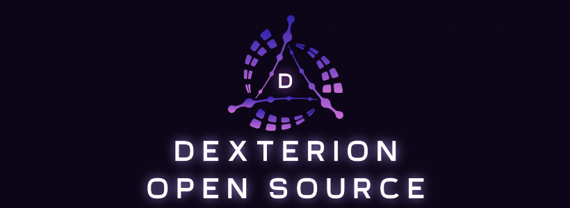



 

Welcome to **Dexterion**!\

## Table of contents

## HowtoUse

## Contributing
Download the code from the green button that says `Code`.
Extract the RAR file into any folder.
Open `Dexterion.sln` in Visual Studio, set build configuration to **Release | x64**.
Press Build solution and you should receive **Dexterion.exe** file in the path `Dexterion/x64/Release/`

Little story about compiling the source:
Recently, some portuguese and russian kids asked if this was a virus. They ended up blocking me and I'll tell you how. They made me run the cheat, so I did and they still didn't believe it wasn't malware. They tried compiling the cheat and told me to help them. I was really trying to but they were retarded or something because the wasn't listening to me and didn't know how to extract the src. They blocked me after that failed attempt of extract the file. Don't be like those guys, please.

## Usage
### Update Offsets ( Choose 1 or 2 )
1. Update Offsets. (Run `updateoffsets.cmd` in the same folder as `Dexterion.exe`)

> [!IMPORTANT]
> Close Visual Studio to stop the released version that is ran automaticaly when you build.\
> Then go to the `/x64/Release/` path and open dexterion.\
> **If you use the version that was ran when you built the application this will be bugged.**
### Run
4. Run `Dexterion.exe` From release path
5. Follow Terminal instructions.
6. Wait For Load.

### Toggle/Kill UI
- Toggle UI: `Inset` key.
- Terminate UI: `End` key.

### Using Icon Fonts
Move fonts folder to the same folder as `Dexterion.exe` is.

### Config
All config files are located on `X:\Dexterion`
`X` will be the letter of the disk you're running dexterion on
#### Example:
- If you run `Dexterion.exe` in a pendrive which letter is `F:`, Dexterion config files will be in `F:\Dexterion`

## Anti-Cheat
> [!CAUTION]
> **This software constitutes a cheat and is in *violation of the Terms of Service (ToS)* of any game in which it is used. We disclaim all liability for any *account bans* or *penalties incurred* as a result of its use. By using this software, you acknowledge that you are solely responsible for any consequences. USE AT YOUR OWN RISK**

## Features
- ESP
- Health bar (+ HP counter)
- Player name
- Weapon icons / names
- Skeleton
- Joints
- Head
- Snap lines
- Distance
- Aim
- Aimbot (+ Player lock)
- Recoil control system
- Trigger bot
- Misc
- Deathmatch Mode
- Dropped item ESP
- Bomb Timer
- Spectator List
- Probably more things I forgot to add.

## IsThisVirus
- Short answer, no.
- But, if you are too lazy to view the source code, just don't use this.

## Credits

## Disclaimer
> [!IMPORTANT]
> We are not responsible for any **banned accounts** and the **bad use** of this application.\
> **USE AT YOUR OWN RISK**.

> [!NOTE]

## License
> [!NOTE]

<h2>Previews</h2>

